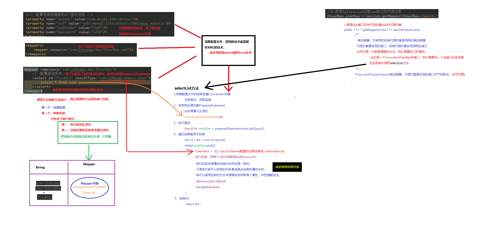

# 1. 三层架构  
- 表现层：用于展示展示数据  
- 业务层：处理业务需求  
- 持久层：和数据库进行交互
# 2. 持久层技术解决方案
- JDBC技术（最底层）：Connection、 PreparedStatement、 ResultSet。
- Spring的Jdbctemplate：Spring中对jdbc的简单封装。
- Apache的DButils：和Spring的Jdbctemplate很像，也是对jdbc的简单封装。  
以上这些都不是框架，JDBC是规范。Spring的Jdbctemplate和Apache的DButils都只是工具类。
# 3. MyBatis 的概述
​		mybatis是一个基于java的持久层框架，是和数据库交互的，进行增删改查操作。内部封装类jdbc，是开发者只需要关注sql语句本身，而不需要花费精力处理加载驱动、创建链接、创建statement等过程。

​		mybatis通过xml或注解方式将要执行的各种statement配置起来，并通过java对象和statement中sql的动态参数进行映射生成最终执行的sql语句，最后由mybatis框架执行sql并将结果映射为java对象并返回。

​		采用ORM思想解决了实体和数据库映射的问题，对jdbc进行了封装，屏蔽了jdbc api底层访问细节，而不需要与jdbc api打交道，就能完成对数据库的持久化操作。

ORM： Object Relational Mapping 对象关系映射。简单的说，就是把数据库表和实体类及实体类的属性对应起来，从而实现操作实体类就实现操作数据库表。

# 4.  mybatis的入门
## 1. mybatis的环境搭建
1. 创建流程
    第一步：创建maven工程并导入坐标  
    第二步：创建实体类和dao的接口  
    第三步：创建Mybatis的主配置文件 SqlMapConfig.xml  
    第四步：创建映射配置文件 IUserDao.xml  
2. 具体流程⚠️：
    1. navicat需要配合mysql软件才能使用
    2. 启动 mysql 软件，首先需要在 系统偏好设置 中进入到 mysql 中， 点击 start mysql server。其次，需要在 终端 中输入 PATH=$PATH:/usr/local/mysql/bin （因为这是mysql的默认位置），再输入 mysql -u root -p 以及 密码（我的密码是：12345678，初始设置密码为 yhf1995116!）。
    3. 打开 navicat 软件，连接 mysql， 连接名随便， 主机名默认（localhost），端口号默认（3306），用户名默认（root），密码为上述密码（12345678）。 数据库中的数据库列表都勾选，否则到时候要使用的时候不会显示出来。此时可以点击 连接测试，查看是否成功连接。
    4. IDEA中创建项目时点击Maven，直接按 next， 此时需要点击 Artifact Coordinates， 将ArtifactId进行修改，GroupId可以修改也可不修改，则创建完成该项目。
        - 修改pom.xml文件。修改后刷新，会自动在Libraries中生成相应的jar文件
        ```xml
        <packaging>jar</packaging>
            <dependencies>
            <dependency>
                <groupId>org.mybatis</groupId>
                <artifactId>mybatis</artifactId>
                <version>3.5.6</version>
            </dependency>
            <dependency>
                <groupId>mysql</groupId>
                <artifactId>mysql-connector-java</artifactId>
                <version>8.0.23</version>
            </dependency>
            <!-- 日志互换 -->
            <dependency>
                <groupId>log4j</groupId>
                <artifactId>log4j</artifactId>
                <version>1.2.13</version>
            </dependency>
            <!-- 单元测试 -->
            <dependency>
                <groupId>junit</groupId>
                <artifactId>junit</artifactId>
                <version>4.10</version>
            </dependency>
        </dependencies>
        ```
        - 需要注意的是 Preferences -> Build... ->Build Tools -> Maven 中的 Maven home dirctory, User setting file 和 Local repository 其前面的要在同一个文件中，第二个可在第一个的目录下找到/conf/settings.xml， 第三个需要添加一个repository文件夹，然后将地址弄到该文件夹下，同时也需要在 File -> New Projects Settings -> Preferences for New Projects 中国找到上述三个需要设置地址的设置，改成与上述一样的地址。
        - 此后在创建的项目下的src->main->java中创建 package，最下层为dao，在其中创建 名为IUserDao.java的接口（interface），并定义方法名。
        - 创建一个与dao在同一级的domain包，并创建一个名为User 的class文件，在 public class User后添加 implements Serializable， 在大括号里面定义 private（私有）的参数，此后在下方右击，点击Generate，再点击 Getter and Setter ，此后可以自动生成上述参数的Getter and Setter，此后在下方右击，点击Generate，再点击 toString(),自动生成toString方法。
    5. 报错
        java: 错误: 不支持发行版本 5 的解决方法如下：
        1. 在Intellij中点击“File” -->“Project Structure”，看一下“Project”和“Module”栏目中Java版本是否与本地一致，如果不一致，改成本地使用的Java版本。
        2. 点击“Settings”-->“Bulid, Execution,Deployment”-->“Java Compiler”，Target bytecode version设为本地Java版本。（可以在Default Settings中把Project bytecode version 一劳永逸地配置成本地Java版本）

## 2. 环境搭建的注意事项：  
- 创建IUserDao.xml 和 IUserDao.java 时，名称接口名称和映射文件是为了和之前的知识保持一致，在Mybatis中把持久层的操作接口名称和映射文件也叫做 Mapper，所以 IUserDao和IUserMapper是一样的；
- 在idea中创建目录时，它和包是不一样的，包创建时：com.itheima.dao是三级结构，目录在创建时：com.itheima.dao是一级目录；
- mybatis的映射配置文件位置必须和dao接口的包结构相同；
- 映射配置文件的mapper标签 namespace 属性的取值必须是dao接口的全限定类名；
- 映射配置文件的操作配置（select），id属性的取值必须是dao接口的方法名。
遵从第3-5点，开发时无需在写dao的实现类。

## 3. mybatis 入门案例  
1. 读取配置文件  
2. 创建SqlSessionFactory工厂  
3. 创建SqlSession  
4. 创建Dao接口的代理对象  
5. 执行dao中的方法
6. 释放资源


注意事项：不用忘记在配置中告知mybatis要封装到哪个实体类中，配置的方式：指定实体类的全限定类名。

mybatis 基于注解的入门案例：  
    把IUserDao.xml 移除，在dao接口的方法上使用@select注解，并指定SQL语句，同时需要在SqlMapConfig.xml中的mapper配置时，使用class属性指定dao接口的全限定类名。

明确：在实际开发中，越简单越好，所以采用不写dao实现类的方式。不管xml还是注解配置。但是Mybatis是支持dao实现类的。

## 4. 自定义mybatis的分析  
mybatis在使用代理dao的方法实现增删改查时做的事：
1. 创建代理对象
2. 在代理对象中调用selectList




## 5. mybatis主配置文件中的常用配置  
properties标签，用于数据库连接的内外部配置。  
typeAliases标签，用于对全类名设置别名。  
mappers标签的子标签：package，用于指定类。  
具体内容查看 https://blog.csdn.net/qq_40981851/article/details/104191877

1. properties标签  
    可以在标签内部配置连接数据库的信息。也可以通过属性引用外部配置文件信息
    - resource属性： 常用的
        用于指定配置文件的位置，是按照类路径的写法来写，并且必须存在于类路径下。
        ```xml
            <properties resource="jdbcConfig.properties">
            </properties>
        ```
    - url属性：
        是要求按照Url的写法来写地址
        URL：Uniform Resource Locator 统一资源定位符。它是可以唯一标识一个资源的位置。
        它的写法：
            http://localhost:8080/mybatisserver/demo1Servlet
            协议      主机     端口       URI

        URI:Uniform Resource Identifier 统一资源标识符。它是在应用中可以唯一定位一个资源的。
        ```xml
            <properties url="file:///Users/yhf/Desktop/java/mybatis-spring-springmvc-oracle-maven高级-权限管理/01-MyBatis/02-第二天/代码/代码/day02_eesy_01mybatisCRUD/src/main/resources/jdbcConfig.properties">
            </properties>
        ```

2. typeAliases标签  
    使用typeAliases配置别名，它只能配置domain中类的别名。
    ```xml
    <typeAliases>
        <!--typeAlias用于配置别名。type属性指定的是实体类全限定类名。alias属性指定别名，当指定了别名就不再区分大小写 
        <typeAlias type="com.itheima.domain.User" alias="user"></typeAlias>-->
        <!-- 用于指定要配置别名的包，当指定之后，该包下的实体类都会注册别名，并且类名就是别名，不再区分大小写-->
        <package name="com.itheima.domain"></package>
    </typeAliases>
    ```

3. mappers标签的子标签：package
    ```xml
    <mappers>
        <!--<mapper resource="com/itheima/dao/IUserDao.xml"></mapper>-->
        <!-- package标签是用于指定dao接口所在的包,当指定了之后就不需要在写mapper以及resource或者class了 -->
        <package name="com.itheima.dao"></package>
    </mappers>
    ```

# 5. mybatis中的连接池以及事务控制
## 1. 连接池的使用  
实际开发中都会使用连接池，因为可以减少获取连接所消耗的时间。
连接池就是用于存储连接的一个容器，而这个容器就是一个集合对象，该集合必须是线程安全的，不能两个线程拿到同一连接，该集合还必须实现队列特性：先进先出。
## 2. mybatis中的连接池  
mybatis连接池提供三种方式的配置
配置的位置：主配置文件SqlMapConfig.xml中的dataSource标签，type属性就是表示采用何种连接池方式。  
type属性的取值：
- POOLED 采用传统的javax.sql.DataSource规范中的连接池，mybatis中有针对规范的实现
-UNPOOLED 采用传统的获取连接的方式，虽然也实现Javax.sql.DataSource接口，但是并没有使用池的思想。
- JNDI 采用服务器提供的JNDI技术实现，来获取DataSource对象，不同的服务器所能拿到DataSource是不一样。注意：如果不是web或者maven的war工程，是不能使用的。课程中使用的是tomcat服务器，采用连接池就是dbcp连接池。


## 3. mybatis中的事务
1. 什么是事务
    事务（Transaction)是数据库操作的最小工作单元，是作为单个逻辑工作单元执行的一系列操作；这些操作作为一个整体一起向系统提交，要么都执行、要么都不执行；事务是一组不可再分割的操作集合（工作逻辑单元）。
2. 事务的四大特性ACID
    原子性（Atomicity )、一致性（Consistency )、隔离性（Isolation) 和持久性（Durability),简称为事务的ACID特性。
    1. 原子性。 事务是数据库的逻辑工作单位，事务中包含的各操作要么都做，要么都不做。任何一项操作失败都将导致整个事务失败，同时其他已经被执行的操作都将被撤销并回滚，直到所有的操作全部成功，整个事务才算是成功完成。
    2. 一致性。 事务的执行不能破坏数据库数据的完整性和一致性，事务执行的结果必须是使数据库从一个一致性状态变到另一个一致性状态。因此当数据库只包含成功事务提交的结果时，就说数据库处于一致性状态。如果数据库系统运行中发生故障，有些事务尚未完成就被迫中断，这些未完成事务对数据库所做的修改有一部分已写入物理数据库，这时数据库就处于一种不正确的状态，或者说是不一致的状态。 
    3. 隔离性。 一个事务的执行不能其它事务干扰。即一个事务内部的操作及使用的数据对其它并发事务是隔离的，并发执行的各个事务之间不能互相干扰。 
    4. 持续性。 也称永久性，指一个事务一旦提交，它对数据库中的数据的改变就应该是永久性的。接下来的其它操作或故障不应该对其执行结果有任何影响。 
3. 不考虑隔离性会产生的3个问题
    1. 脏读。 脏读是指在一个事务处理过程里读取了另一个未提交的事务中的数据。当一个事务正在多次修改某个数据，而在这个事务中这多次的修改都还未提交，这时一个并发的事务来访问该数据，就会造成两个事务得到的数据不一致。
    2. 不可重复读。 不可重复读是指在对于数据库中的某个数据，一个事务范围内多次查询却返回了不同的数据值，这是由于在查询间隔，被另一个事务修改并提交了。
    3. 虚读(幻读)。 幻读是事务非独立执行时发生的一种现象。
    **区别**：不可重复读和脏读的区别是：脏读是某一事务读取了另一个事务未提交的脏数据，而不可重复读则是读取了前一事务提交的数据。幻读和不可重复读都是读取了另一条已经提交的事务（这点就脏读不同），所不同的是不可重复读查询的都是同一个数据项，而幻读针对的是一批数据整体（比如数据的个数）。
4. 解决方法：四种隔离级别
    1. Serializable (串行化)：可避免脏读、不可重复读、幻读的发生。 它要求所有事务都被串行执行，即事务只能一个接一个地进行处理，不能并发执行。
    2. Repeatable read (可重复读)：可避免脏读、不可重复读的发生。保证在事务处理过程中，多次读取同一个数据时，其值都和事务开始时刻是一致的。因此该事务级別禁止了不可重复读取和脏读取，但是有可能出现幻影数据。
    3. Read committed (读已提交)：可避免脏读的发生。 和未授权读取非常相近，唯一的区别就是授权读取只允许获取已经被提交的数据。
    4. Read uncommitted (读未提交)：最低级别，任何情况都无法保证。 如果一个事务正在处理某一数据，并对其进行了更新，但同时尚未完成事务，因此还没有进行事务提交，而与此同时，允许另一个事务也能够访问该数据。
    **扩展**：以上四种隔离级别最高的是*串行化*，最低的是*读未提交*，当然级别越高，执行效率就越低。像*串行化*这样的级别，就是以锁表的方式(类似于Java多线程中的锁)使得其他的线程只能在锁外等待，所以平时选用何种隔离级别应该根据实际情况。在MySQL数据库中默认的隔离级别为*可重复读*。而在Oracle数据库中，只支持*串行化*和*读已提交*这两种级别，其中默认的为*读已提交*。
5. mybatis中的事务  
    它是通过sqlsession对象的commit方法和rollback方法实现事务的提交和回滚。


# 6. mybatis基于XML配置的动态SQL语句使用
1. <if>标签
    ```xml
    根据条件查询
    <select id="findUserByCondition" resultMap="userMap" parameterType="user">
        select * from user where 1=1
        <!-- if标签中只能使用and 不能使用&& -->
        <if test="userName != null and username != ''">
        and username = #{userName}
        </if>
        <if test="userSex != null">
            and sex = #{userSex}
        </if>
    </select>
    ```
2. <where>标签
    ```xml
    根据条件查询
    <select id="findUserByCondition" resultMap="userMap" parameterType="user">
        select * from user
        <where>
            <if test="userName != null and username != '' ">
            and username = #{userName}
            </if>
        </where>
    </select>
    ```

3. <foreach>标签  
    SQL 语句:
    ```sql select 字段 from user where id in (?)```
    <foreach>标签用于遍历集合，它的属性: collection:代表要遍历的集合元素，注意编写时不要写#{},open:代表语句的开始部分,close:代表结束部分，separator：表示分隔符。
    ```xml
    <!-- 放在if标签里面 -->
    <foreach collection="ids" open="and id in (" close=")" item="uid" separator=",">
        <!-- 这里的uid要与 item 里所取的名称相同 -->
        #{uid}
    </foreach>
    ```

4. 简化编写的 SQL 片段  
    Sql 中可将重复的 sql 提取出来，使用时用 include 引用即可，最终达到 sql 重用的目的。
    ```xml
    <!-- 抽取重复的语句代码片段 --> 
    <sql id="defaultSql">
        select * from user
    </sql>
    <select id="findAll" resultType="user">
        <include refid="defaultSql"></include> 
    </select>
    ```

# 7. mybatis中的多表操作
表之间的关系：一对多、多对一、一对一、多对多。  
mybatis中把多对一看成了一对一
mybatis中的多表查询  
1. **示例1**：用户和账户（一对多）  
    **步骤**：
    1. 建立两张表：用户表和账户表。让两表之间具备一对多的关系：需要使用外键在账户表中添加
    2. 建立两个实体类：用户实体类和账户实体类。让用户和账户的实体类体现出一对多的关系。
    3. 建立两个配置文件：用户和账户的配置文件。
    4. 实现配置：当查询用户时，可以同时得到用户下所包含的账户信息；当查询账户时，可以同时得到账户的所属用户信息。

2. **示例2**：用户和角色（多对多）  
    **步骤**：
    1. 建立两张表：用户表和角色表。让两表之间具备多对多的关系：需要使用中间表，中间表中包含各自的主键，在中间表中是外键。
    2. 建立两个实体类：用户实体类和角色实体类。让用户和角色的实体类体现出多对多的关系。各自包含对方一个集合引用。
    3. 建立两个配置文件：用户和角色的配置文件。
    4. 实现配置：当查询用户时，可以同时得到用户下所包含的角色信息；当查询角色时，可以同时得到角色的所赋予的用户信息。

# 8. Mybatis中的延迟加载
**问题一：**一对多中，有一个用户有100个账户。在查询用户时，用户下的账户信息应该是什么时候使用，什么时候查询。在查询账户时，账户的所属用户信息应随着账户查询时一起查询出来。

**延迟加载**：在真正使用数据时才发起查询，不用时不查询。按需加载（懒加载）

**立即加载**：不管用不用，只要一调用方法，马上发起查询。

在对应的四种关系中：  
一对多，多对多：通常情况下，都是采用延迟加载。  
多对一，一对一：通常情况下，都是采用立即加载。

# 9. mybatis中的缓存
1. 什么是缓存  
    存在于内存中的临时数据
2. 为什么使用缓存  
    减少与数据库的交互次数，提高执行效率
3. 什么样的数据能使用缓存  
    适用于缓存：1）经常查询，并且不经常改变。2）数据的正确与否最终结果影响不大。  
    不适用于缓存：1）经常改变的数据。2）数据的正确与否对最终结果影响很大。如商品懂得库存、银行的汇率、股市的牌价。
4. mybatis中的一级缓存和二级缓存  
    一级缓存：指的是mybatis中SqlSession对象的缓存。当执行查询之后，查询结果会同时存入SqlSession为我们提供一块区域中，该区域的结构是一个Map。再次查询同样的数据，mybatis会先去SqlSession中查询是否有，有的话直接使用。当SqlSession对象消失时，mybatis缓存也会消失。
    二级缓存：指的是mybatis中SqlSessionFactory对象的缓存，由同一个SqlSessionFactory对象创建的SqlSession共享缓存。存放的内容是数据，而不是对象。
    二级缓存的使用步骤：
    1. 让mybatis框架支持二级缓存（在SqlMapConfig.xml中配置）
    2. 让当前的映射文件支持二级缓存（在IUserDao.xml中配置）
    3. 让当前的操作支持二级缓存(在select标签中配置)

# 10. mybatis中的注解开发
**好处**：减少编写Mapper映射文件。
**常用注解说明**:
```
@Insert:实现新增 
@Update:实现更新
@Delete:实现删除 
@Select:实现查询 
@Result:实现结果集封装。表中为key的列（如id）需要设置id属性，其他的不需要。但都需要设置 column 属性（为数据库中的名称）和 property 属性（实体类中定义的名称）。
@Results:可以与@Result 一起使用，封装多个结果集。可定义一个id，同时将多个@Result放入value属性中。
@ResultMap:实现引用@Results 定义的封装。可直接将@Results的id名称放入其中。
@One:实现一对一结果集封装。代替了<assocation>标签，是多表查询的关键，在注解中用来指定子查询返回单一对象。使用格式：@Result(column=" ",property="",one=@One(select=""))。select 指定用来多表查询的 sqlmapper。fetchType 会覆盖全局的配置参数 lazy、Loading、Enabled。one=@One(select="com.itheima.dao.IUserDao.findById", fetchType=FetchType.LAZY)
@Many:实现一对多结果集封装。代替了<Collection>标签,是是多表查询的关键，在注解中用来指定子查询返回对象集合。使用格式：@Result(property="",column="",many=@Many(select=""))。使用同 @One 。
@SelectProvider: 实现动态SQL映射 
@CacheNamespace:实现注解二级缓存的使用。@CacheNamespace(blocking=true)，表示的是mybatis 基于注解方式实现配置二级缓存，在持久层接口中。
```
**注意点**：使用注解时，不能编写Mapper映射文件，否则代码会报错，因为系统无法确定是使用注解还是映射文件来实现。